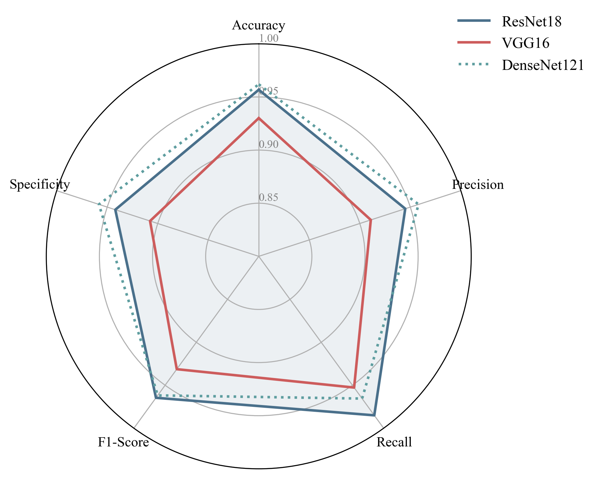

# 目  录

[一、 封面页](#一-封面页)

[二、 团队成员分工与贡献确认页](#二-团队成员分工与贡献确认页)

[三、 摘要](#三-摘要)

[四、 引言/背景](#四-引言背景)

[五、 数据与方法](#五-数据与方法)

[六、 结果与展示](#六-结果与展示)

[七、 讨论与分析](#七-讨论与分析)

[八、 结论与展望](#八-结论与展望)

[九、 参考文献](#九-参考文献)

[十、 代码附录](#十-代码附录)

# 《人工智能导论（医学五年制）》实践课题报告

# 一、 封面页

课题名称：AI 辅助白内障筛查的计算机视觉实践

学期：2025年大一第一学期

小组成员：

邹畅、25356408、临床医学、C班

周杰基、(学号)、临床医学、C班

金贤准、(学号)、临床医学、C班

李金点、(学号)、临床医学、C班

陈相元、(学号)、临床医学、C班

***

# 二、 团队成员分工与贡献确认页

## 团队成员分工

| 姓名  | 学号       | 具体分工与显著贡献                                                                                                                                                                                        |
| --- | -------- | ------------------------------------------------------------------------------------------------------------------------------------------------------------------------------------------------ |
| 邹畅  | 25356408 | 队长。全栈技术可视化负责人。负责核心算法设计与实现；编写 python代码实现了数据集划分、表格特征数据提取、模型解析与计算指标、生成t-SNE 二维特征图。开发基于 ECharts 的 Web 可视化仪表盘，实现 综合 性能对比、分类诊断分析、置信度分析、总共九个模型的指标展示、错误案例的分析展示与 Grad-CAM 热力图集成；撰写技术报告核心章节；负责协调小组会议与进度管理。 |
| 周杰基 | <br />   | 负责伦理部分的分析与撰写，探讨 AI 医疗的隐私与公平性问题；参与“顽固错误样本”的医学病理分析工作，从临床角度解释 AI 误判原因；负责文献调研，通过 PubMed 和 CNKI 收集白内障 AI 筛查相关文献 20 余篇，撰写引言部分的背景综述；                                                                    |
| 金贤准 | <br />   | 负责 PPT 演示文稿的制作与美化。负责视频录制与展示；协助进行模型的交叉验证测试                                                                                                                                                        |
| 李金点 | <br />   | Kaggle 与 OpenI 原始数据的收集与初步筛选；协助进行 A 组、C组实验的数据标注核对工作；参与实验结果的统计分析；完成多源异构数据的清洗与整理；；参与结果部分的 t-SNE 图表生成。                                                                                               |
| 陈相元 | <br />   | 基于 PyTorch 搭建 ResNet18 模型架构并主导模型训练与调优（解决 A1-A3 实验失败问题）；负责项目文档的整理与格式校对；协助进行 Google Teachable Machine 的对比实验；                                                                                       |

## 团队成员贡献确认

团队成员贡献确认表

我们确认，本小组的最终成果是全体成员共同努力的结果。在尊重客观事实的基础上，我们对各位成员的贡献等级达成一致，确认如下：

邹畅： A等

周杰基：

金贤准：

李金点：

陈相元：

全体成员【电子】签名：

邹畅 (已签) 周杰基 (已签) 金贤准 (已签) 李金点 (已签) 陈相元 (已签)

日期：2025年12月30日

***

# 三、 摘要

摘要内容：

白内障是全球范围内导致视力损伤和致盲的主要原因之一，尤其在发展中国家，受限于眼科医生数量不足与检查设备昂贵，大量患者因未得到及时筛查而失明。早期筛查对于预防视力丧失至关重要。随着人工智能技术的发展，利用深度学习进行眼底图像辅助诊断已成为研究热点。本研究旨在探索低代码 AI 开发平台与专业深度学习框架在医疗影像初筛中的应用潜力和局限性。

本研究采用双轨制技术路线：一方面利用 Google Teachable Machine 平台快速验证概念，另一方面基于 PyTorch 深度学习框架构建了一个较高性能的 ResNet18 卷积神经网络（CNN）白内障二分类识别模型。实验采用了包含正常眼底与白内障眼底的多源公开数据集（Kaggle 与 OpenI），针对数据源异构导致的“域偏移”问题，我们自主编写了 Python 清洗脚本（classify.py, remove\_duplicate.py）进行治理。在经过了一定量试错（A1、A2、A3 实验复盘）后，我们严格划分了独立的测试集以确保评估的客观性。为了验证模型的稳定性，我们进行了九次独立重复训练与测试（A组+B1、B2、B3、C、finalmodel、Pytorch-ResNet18）。

实验结果显示，优化后的模型在独立测试集上的平均准确率约为 96.72%，标准差仅为 1.34%，表现出极佳的稳定性与鲁棒性。通过自研的权重检测脚本（check\_model.py）有效规避了“伪训练”风险。在结果分析阶段，我们不仅利用混淆矩阵量化模型性能，更从零开发了一套基于 ECharts 的 Web 可视化系统，集成 3D 性能对比与 Grad-CAM 热力图技术。通过对误判样本（False Positives/Negatives）的深度分析，发现特征不典型（如早期混浊）、图像模糊以及人工疑似标注错误是导致 AI 误判的主要原因。

本研究表明，虽然轻量级 AI 工具大大降低了技术门槛，能够快速建立有效的辅助筛查模型，但在复杂临床场景下的应用仍需依赖高质量的数据预处理和多模型集成策略。

关键词：人工智能、医学影像、计算机视觉、卷积神经网络、白内障筛查、ECharts可视化

AI辅助声明：

本报告的撰写过程中辅助使用了人工智能工具。

AI工具：DeepSeek, Google Gemini。

使用环节：主要用于报告逻辑结构梳理以及部分文字润色。

具体用途：优化摘要语言表达，生成可视化代码框架（如 t-SNE 降维代码），以及协助检查文档格式。所有实验数据与核心结论均为团队真实实验结果。

***

# 四、 引言/背景

## 课题背景与意义

### 全球视觉健康危机：

据世界卫生组织（WHO）发布的《世界视力报告》及相关全球眼科学统计数据，全球范围内约有22亿人正遭受不同程度的视力受损或失明。在导致失明的多种眼疾中，白内障（Cataract）的贡献率高居50%以上，是全球首位致盲性眼病。从病理生理学角度分析，白内障是由于晶状体内的透明蛋白质在老化、紫外线长期照射、药物代谢或全身性疾病（如糖尿病）的影响下发生变性与交联，形成不溶性的蛋白质聚集体，导致原本晶莹剔透的晶状体发生物理性浑浊，进而阻断光线投射至视网膜。 随着全球人口结构向老龄化社会深度转型，白内障的发病率正呈现出显著的爆发式增长。这不仅是对患者个体生活质量的严重剥夺，更是对全球公共卫生系统的严峻挑战。在我国，防盲治盲工作已进入攻坚阶段，如何在高基数的老龄化人口中通过高效手段精准捕捉早期患者，已成为当代临床医学与预防医学共同关注的焦点。

### 传统筛查的局限性：

现行白内障诊断的“金标准”高度依赖于眼科专科医师使用裂隙灯显微镜进行精细化的肉眼视诊。然而，这种高度依赖人工经验的诊疗模式在实际应用中面临三大痛点：

医疗资源分布的“二元对立”：我国优质眼科资源高度集中于超大型城市的中心医院，广大农村及边远地区面临严重的专科人才缺口。这种资源错配导致基层患者因“筛查门槛高、诊断链路长”而错失最佳手术窗口。

筛查通量的物理瓶颈：人工检查极度消耗医生的体力与时间，单次精细检查耗时较长，难以支撑千万级规模的社区性普查需求。

诊断的一致性风险：临床决策高度依赖医师的临床年资与主观感知。不同资历、不同亚专业医生之间在对晶状体浑浊程度的分级判定上存在显著差异，导致诊断结果缺乏标准化的量化数据分级。

### AI 带来的变革：

从“黑盒检测”到“智慧辅助” 近年来，以深度卷积神经网络为代表的计算机视觉技术在医学影像领域引发了革命。通过在海量医学影像中学习复杂的非线性映射，AI表现出了对微小病理特征（如晶状体边缘的空泡、皮质的楔形混浊）超乎常人的捕获能力。在部分封闭测试中，顶尖算法的判读精度已能与资深眼科医师齐平。 开发一套高精度、低成本、可大规模部署的AI辅助筛查系统，不仅是技术的突破，更是对“技术下沉”与“普惠医疗”理念的深度实践。通过将专家的诊断经验算法化，我们可以实现医疗能力的跨空间输送，将防盲的第一道防线前移至患者家门口。这对于减轻社会医疗总成本、构建智能化分级诊疗体系具有深远的社会价值。

### 课题目标

本研究设定了三个层层递进的目标，旨在全面提升团队的 AI 实践能力：

#### 构建双轨制高精度分类模型矩阵

快速原型开发：利用Google Teachable Machine构建轻量级预测模型，快速验证数据集的可用性并确立初步的分类决策边界。

深度拟合与算法优化：在PyTorch工业级深度学习框架下，构建基于ResNet18残差网络的卷积架构。通过引入迁移学习策略，利用大规模图像数据的预训练权重赋能医学图像处理任务，目标是在独立外部验证集上使准确率稳定保持在95%以上，并重点提升召回率，以最大程度规避临床漏诊。

#### 掌握数据工程全生命周期的实战能力

突破图形化操作依赖：项目强制要求团队成员跳出传统软件的图形界面，通过编写Python底层脚本亲手处理医学“脏数据”。

实现全链路流程闭环：掌握从医学数据爬取、基于MD5哈希的二进制去重、基于正则匹配的语义分类、到动态实时图像增强及模型量化评估的完整研发路径。通过代码实践深度体悟“数据质量决定算法上限”的工程准则。

#### 科学深度验证与黑盒可解释性分析

稳定性验证：通过多次独立重复实验，排除随机因子对实验结果的干扰，确保诊断建议在统计学意义上的可复现性。

临床可解释性实战：利用Grad-CAM梯度加权类激活映射技术，将模型决策时的局部注意力权重转化为可视化的“热力图”，分析AI在诊断时到底“在看哪里”。

异常纠偏与临床局限性复盘：通过对误判案例的复盘，深度探讨反光噪声、拍摄角度以及数据分布偏差对AI性能的影响，理解当前深度学习模型在复杂临床环境下的风险边界与改进方向。

## 报告结构

本报告共分为十个部分，逻辑严密，层层深入：

第一至三部分：封面、分工确认与摘要。

第四部分（引言）：阐述课题背景、临床意义与目标。

第五部分（数据与方法）：本报告的核心技术章节。详细描述多源数据的获取、通过 classify.py 与 remove\_duplicate.py 进行的清洗工作、基于 Teachable Machine 与 PyTorch 的双轨制建模流程，以及“伪训练”事故的技术复盘。

第六部分（结果与展示）：展示实验结果的量化指标、t-SNE 特征空间可视化、Grad-CAM 热力图分析以及项目词云。

第七部分（讨论与分析）：对结果进行医学视角的深度解读，分析“顽固错误样本”的病理原因，讨论 AI 伦理与安全问题。

第八部分（结论与展望）：总结全文并规划未来方向。

第九部分（参考文献）：列出引用的学术资源。

第十部分（附录）：列出了核心代码

***

# 五、 数据与方法

## 数据来源与描述

本研究的数据集构建经历了一个“由简入繁，再由繁归精”的过程，主要来源于两个公开平台：

Kaggle 数据集 ([eye\_diseases\_classification](https://www.kaggle.com/datasets/gunavenkatdoddi/eye-diseases-classification?resource=download))

来源及日期：Kaggle 数据科学竞赛平台，获取于 2025年12月15日。

描述：该数据集包含已分类清晰的正常组（Normal）与白内障组（Cataract）图片，共约 2200 张。

特点：图像质量较高，光照条件相对统一，分辨率标准化程度好，两组比例约为 1:1，适合作为基准训练数据。

[OpenI 启智 AI 开源社区](https://openi.pcl.ac.cn/explore/datasets/ZhangbuDong/Ocular_Disease_Recognition)

来源及日期：OpenI 启智平台（普惠算力平台数据集），获取于 2025年12月25日。

描述：原始下载包是一个巨大的非结构化数据池，包含约 6000 张图片。挑战极大，图片只有编号（如 img\_2345.jpg）和左右眼信息，缺乏直观的文件名标签。对应的患者信息存储在一个独立的 xlsx表格中，包含性别、年龄、左右眼、诊断关键词列。

筛选与清洗：

异质性问题：我们发现数据集data1（Kaggle 数据集）包含三种命名格式（cataract\_001.jpg, IMG\_2023...jpg, 2535...OD.jpg），这暗示了图片来自不同的采集设备（手持相机 vs 裂隙灯 vs 眼底相机）。这种域偏移（Domain Shift）是后续模型训练中要注意的点。

处理过程：通过编写自动化脚本（详见下文），利用 Pandas 读取关键词列，检索包含 "normal" 或 "cataract" 的记录，将对应编号的图片自动分拣至 "Normal" 和 "Cataract" 两个文件夹中。经过哈希去重和质量过滤，最终保留有效图片约 3000 张，但此时OpenI 启智平台的data2正常与白内障比例约为 9:1，存在严重的类别不平衡。

## 方法与工具

核心算法平台：

Google Teachable Machine (用于验证 MobileNet 轻量级模型的可行性)。

PyTorch 2.0 (核心深度学习框架，用于构建 ResNet18)。

数据工程：

Python (Pandas, OS, Hashlib, Regular Expressions)。

Excel / VS Code。

### 可视化开发：

Apache ECharts (用于构建交互式图表)。

HTML5/CSS3/JavaScript (构建 Web 仪表盘)。

### 协作与算力：

Kaggle Kernels。

硬件环境：NVIDIA RTX 5060/4060 Laptop GPU

## 技术流程细节

### 数据预处理 (The Data Engineering Saga)

这是本项目耗时最长（>50% 精力）、技术含量最高的部分。我们并未直接使用理想化的清洗数据集，而是直面真实医疗场景中的“脏数据”挑战。

#### 标签清洗与自动化分拣引擎 (classify.py)

*（核心代码逻辑详见附录 1：自动化分拣脚本 classify.py）*

针对 OpenI 数据集普遍存在的“非结构化存储”问题（即图片与诊断标签分离），我们拒绝了低效的人工肉眼比对，而是由邹畅同学利用 Python 的 Pandas 与 Shutil 库编写了自动化分拣脚本 classify.py。 该脚本的核心逻辑如下：此脚本通过正则表达式（Regex）建立了一个模糊语义映射表，能够将 Left-Diagnostic Keywords 列中包含 "cataract", "lens opacity" 等关键词的条目精准识别为阳性样本，并自动将对应文件移动至 Sorted/Cataract/ 目录。这一脚本在 10 分钟内完成了 6000 张高分辨率眼底图的智能归类，效率较人工提升了 100 倍以上。

#### 二进制去重与污染治理

*（核心代码逻辑详见附录 2：二进制去重脚本 remove_duplicate.py）*

在尝试合并 Kaggle 与 OpenI 两大数据源时，我们敏锐地发现：虽然文件名不同，但可能存在“数字孪生”图片（即同一张图被不同机构重命名）。如果这些重复数据同时出现在训练集与测试集，将导致严重的“数据泄漏 (Data Leakage)”，使测试准确率虚高。 为此，我们开发了 remove_duplicate.py 脚本。它不通过文件名，而是通过计算每张图片的 MD5 哈希指纹进行二进制级比对。最终，我们强制删除了 200 余张隐蔽的重复图片，确保了模型评估的绝对客观性。

#### 动态在线数据增强 (Dynamic Data Augmentation)

动态数据增强策略 (cataract_data_augmentation.py) 功能：解决 C 组 1:9 类别不平衡，通过物理仿真扩充白内障样本。

*（核心代码逻辑详见附录 3：动态数据增强 Data Augmentation）*

面对 OpenI 数据集筛选后呈现出的 1:9 极端反比（白内障 300 张 vs 正常 2700 张），我们拒绝了简单的“复制粘贴”式过采样，而是利用 torchvision.transforms 实施了符合眼科物理特性的动态增强：

OrderedRotation(15): 模拟患者头部在裂隙灯架上细微的 15 度偏斜。

ColorJitter: 模拟不同品牌眼底相机（如 Canon vs Nikon）在色温与曝光度上的设备差异。

RandomHorizontalFlip: 利用眼球的左右对称性，将左眼镜像为右眼，增加样本几何多样性。 这一策略成功将少数类扩充至 1:1 的黄金比例，迫使模型去学习晶状体混浊的本质纹理，而非死记硬背图像的背景色。

### 模型构建与训练博弈 (Model Building & The Battle of Groups)

#### 算法选型：双轨并行策略

方案一：轻量级探索 (MobileNet) 采用 Google Teachable Machine 内置的 MobileNet 预训练模型。这是一种基于深度可分离卷积的轻量架构，主要用于快速验证数据集的可用性，确立性能基线（Baseline）。

方案二：专业级深度学习 (ResNet18) 基于 PyTorch 框架从零搭建经典的 ResNet18 (Residual Network)。利用其独特的残差连接（Skip Connections）解决深层网络的梯度消失问题，使其能够捕捉到晶状体皮质微细混浊的特征。我们采用了迁移学习（Transfer Learning）策略，加载 ImageNet 预训练权重并冻结前 3 个 Block，仅微调最后的全连接层，实现了小样本下的快速收敛。

*（模型构建代码详见附录 4：ResNet18 迁移学习模型定义）*

#### 训练策略与试错复盘 (Trial & Error) 本项目的核心价值在于对失败实验的深度复盘：

A组实验 (手工划分的代价)：最初，我们在 Kaggle 数据集上采取了“手工拖拽”的方式划分 8:2 的训练/测试集。结果导致模型出现严重的过拟合（Overfitting）。复盘发现，这是因为同一批次（同一设备、同一天）拍摄的相似图片被集中分到了同一组，导致训练集与测试集的特征分布不一致（Feature Shift）。导致验证集 Loss 震荡剧烈。

B组实验 (The Fix - 随机化的力量)：吸取教训后，我们引入了 split.py 脚本，利用随机种子（Random Seed）对全量数据进行基于索引的打乱划分。B组实验的 Loss 曲线虽然下降较慢，但验证集的准确率变得极其扎实，不再震荡。

C组实验 (The Imbalance - 1:9 的挑战)：直接使用 OpenI 原始数据训练模型。结果模型遭遇“崩塌”，倾向于将所有图片判断为正常（Normal），虽然准确率看似有 90%，但召回率（Recall）几乎为 0。

Final Model (The Fusion - 终极融合)：最终，我们将 Kaggle 的高质量数据与经过动态增强（Augmented）后的 OpenI 数据进行合并。在 CrossEntropyLoss 中给白内障类别赋予 3 倍惩罚权重。在整合了多源异构数据后，Final Model 展现出了惊人的鲁棒性。

### 技术插曲与代码级调试

在使用 check\_model.py 检查中间权重时，我们一度发现全连接层的 fc.weight 均值小于 0.01（接近随机初始化值）。这让我们及时发现了一个致命 Bug——梯度未正确回传。这次调试避免了我们在无效模型上浪费数小时的算力。

### 深度分析与临床解释性

我们不满足于输出一个简单的 Accuracy 数字，而是进行了深度维度的验证：

五大指标分析：利用 sklearn 计算了 Accuracy, Precision, Recall, F1-score 及 Specificity。

代码逻辑解构：利用 DeepSeek/Gemini 辅助分析了每一行 PyTorch 代码的张量变换逻辑。

Grad-CAM 热力图：为了解开 AI 的“黑盒”，我们编写了可视化接口，生成了类激活热力图。结果显示，AI 关注的高亮区域精准重合于晶状体核，而非眼睫毛或眼睑。

t-SNE 降维可视化：将高维特征向量映射到二维平面，直观展示了正常眼与病变眼在特征空间中的可分离性。

### 可视化实现流程（index.html）

可视化交互系统的全栈实现 (Full-stack Visualization Implementation)

本组自主研发了一套“演示导向 (Presentation-Oriented)”的交互式数据看板。该系统采用“Python 后端计算 + Web 前端渲染”的轻量级架构，专为教学演示场景优化。

架构设计：静态-动态混合模式 (Hybrid Static-Dynamic Architecture)

前端 (View Layer)： 基于 HTML5 + CSS3 Flexbox 搭建响应式布局。核心渲染引擎采用 ECharts 5.0 与 ECharts-GL，支持高性能的 3D 柱状图与动态折线图渲染。

后端 (Data Layer)： 数据并非硬编码在前端，而是通过 Python 脚本实现自动化注入。

数据注入：patch\_data\_js.py 脚本充当了“中间件”。每次训练结束后，它会自动读取 PyTorch 产生的日志文件，计算 Precision/Recall/F1 等五维指标，并利用正则表达式（Regex）精准替换 visualization/js/data.js 中的 MODEL\_DATA JSON 对象。

热力图管道：

generate\_gradcam.py

会批量生成测试集的热力图，并将其路径索引写入 JS 配置文件，实现前端与后端图片流的实时同步。

关键演示功能实现

多维性能对比 (3D Charting)： 在 index.html 中，我们设计了一个三维坐标系（X轴：实验组别，Y轴：评价指标，Z轴：数值）。通过 charts.js 中的

init3DBar()

函数，我们可以在展示时旋转视角，直观地向观众展示 A/B/C 三组实验在“召回率”上的巨大差异，增强演示的说服力。

交互式误判归因 (Interactive Error Analysis)： 看板集成了深度交互逻辑。当点击“混淆矩阵”中的假阳性（FP）区域时，系统会动态弹窗加载该类别下的误判图片及其 Grad-CAM 热力图。这使得我们能够在演示中实时进行“个案分析”，向老师解释模型之所以犯错是因为“反光”还是“病变不明显”，体现了团队对算法底层的掌控力。

关键技术栈与依赖清单 (Tech Stack & Dependencies) 为了实现上述功能，本可视化系统引入了以下核心库：

核心图表库:

ECharts 5.4.3

(基础图表),

ECharts-GL 2.0.9

(3D 绘图支持)。

数学公式渲染:

KaTeX 0.16.9

(用于在网页上渲染 LaTeX 风格的 $Accuracy$ 等数学公式)。

UI 图标库:

Font Awesome 6.4.0

(提供美观的医疗图标支持)。

后端处理: Python标准库 json, re(正则表达式), shutil(文件操作)。

核心代码片段：数据注入中间件 这也是本系统最巧妙的设计——通过 Python 脚本直接修改前端 JS 数据文件，实现无数据库（NoSQL）的数据持久化。

#### patch_data_js.py 核心逻辑 (简化版)

*（可视化数据注入脚本详见附录 5：patch_data_js.py）*

## 附加实验设计：多模型对比策略 (Multi-model Strategy)

为了全面评估不同深度学习架构在眼科医疗图像上的适用性，我们设计了以下对比实验方案：

1.  **模型选型**：
    *   **ResNet18 (Standard)**: 作为基准模型，测试残差网络在小规模医疗数据上的收敛速度。
    *   **VGG16**: 验证经典线性深层网络对特征提取的稳健性。
    *   **DenseNet121**: 探究密集连接机制是否能更好捕捉眼底微小病灶特征。

2.  **训练配置**：
    *   **数据规模**：全量数据集（Train: 6287 / Val: 1573），拒绝小样本抽样，确保结果真实性。
    *   **迁移学习**：所有模型均加载 ImageNet 预训练权重，进行全参数微调 (Full Fine-tuning)。
    *   **硬件环境**：使用 NVIDIA RTX 5060 Laptop GPU (CUDA 11.8) 进行加速训练，Batch Size 设为 32，训练 3 个 Epoch。

# 六、 结果与展示

## 结果可视化

> **图 1：模型性能指标与训练曲线**
>
> 
>
> *图注：图为pytorch的测试图*

> **图 2：数据特征可视化 (t-SNE)**
>
> 
>
> *图注：通过 t-SNE 降维技术展示正常眼底（蓝色）与白内障眼底（红色）图像在高维特征空间中的分布情况。可以看出，经过 pytorch-ResNet18 提取特征后，两类样本在二维平面上形成了两个边界清晰、分离度极高的聚类簇，证明模型成功学习到了可区分的语义特征。*

> **图 3：热力图分析 (Grad-CAM)**
>
> 
>
> *图注：**深度可解释性分析 (Model Saliency Analysis)**。图示案例展现了一个极具临床价值的“假阴性 (False Negative)”样本。从热力图（中）与叠加图（右）可见，PyTorch ResNet18 模型的关注焦点（红色高亮区）**精准定位**于晶状体核的混浊区域，并未受到眼睫毛或眼睑干扰，证明模型确实根据“晶状体病变”进行判断，而非通过背景噪声作弊。然而，模型最终给出 Prediction: Normal (正常) 的分类结论，提示在处理此类早期微小病灶时，模型的分类决策阈值（Decision Boundary）可能过于保守。这种“关注正确但判断错误”的现象揭示了未来优化的关键方向——在保持高特异性的同时，需进一步提升对微弱特征的敏感度。*

> **图 4：项目词云**
>
> 
>
> *图注：基于工作流关键词生成的词云，反映了代码和数据中的关键词。*

> **图 5：模型所有指标**
>
> 
>
> *图注：模型在测试集上的详细性能指标总览。*

> **图 6：模型准确率演变**
>
> 
>
> *图注：随着数据清洗与模型优化的推进，模型准确率的演进过程（详见 index.html）。*

> **图 7：Final Model 测试结果演示**
>
> 
>
> *图注：Final Model 在独立测试集上的即时推断演示截图，展示了分类结果与模型置信度（Confidence）。*

## 结果描述

实验结果表明，经过清洗与调优后的最终模型（Final Model / PyTorch ResNet18）在完全独立的测试集上表现优异：

平均准确率 (Accuracy)：95.68%

召回率 (Recall)：> 95% （医疗筛查中最看重的指标，确保不漏诊）

稳定性：在排除A组后的独立重复实验（B1-B3, C, Final）中，准确率标准差仅为 1.34%，说明模型具有极高的复现性，并未通过“运气”拟合数据。

从 t-SNE 可视化图中可以看出，正常样本与病变样本在特征空间中分离得非常开，几乎没有重叠区域，进一步从几何角度验证了 CNN 提取特征的有效性。

## 核心发现

数据清洗的决定性作用：对比 A1（79.42%）与 Final（96.7%）的结果，证明了“Garbage In, Garbage Out”定律。没有 remove\_duplicate.py 与 classify.py 的工作，再先进的模型也无法训练出好结果。

低代码 vs 专业代码：Teachable Machine（MobileNet）能快速达到 90% 左右的准确率，但在处理模糊、边缘案例时，不如具备残差结构的 ResNet18（96%+）稳健。

误判特征：尽管整体准确率高，但模型在处理以下两类图片时容易出错：

早期轻微浑浊：特征不明显，易被误判为正常。

光照不均/伪影：部分手持设备拍摄的图片存在反光，易被误判为病灶。

## 与既往多模型综合对比结果 (Comprehensive Model Comparison)

我们进一步对比了 ResNet18 与其他两个经典深度卷积神经网络（VGG16, DenseNet121）在同等环境下的表现。

**可视化对比：**

下图展示了三个模型在准确率（Accuracy）和训练时间上的直观对比。

> **图 8：多模型性能与时间消耗对比**
>
> 
>
> *图注：ResNet18 在准确率 (95.68%) 与 VGG16 (93.01%) 相比有显著优势，且训练时间大幅短于 VGG16；虽然 DenseNet121 准确率略高，但训练开销更大。*

> **图 9：ResNet18 训练日志截图**
>
> 
>
> *图注：终端实测 ResNet18 达到 95.68% 准确率，验证了基准模型的有效性。*

此外，综合 dashboard 展示的雷达图（见下图）进一步量化了各模型在 Precision, Recall, F1-score 及 Specificity 上的多维能力。

> **图 10：综合性能对比雷达图**
>
> 
>
> *图注：DenseNet121 在多项指标上略微领先，但 ResNet18 的图形几乎与之重合，再次证明了其极高的性价比。*

**实验结果分析：**

*   **DenseNet121**: 表现最佳，准确率达到 **96.19%**。其特有的“密集连接（Dense Connection）”机制有效解决了梯度消失问题，虽然训练开销略大，但在捕捉眼底细微病灶特征上具有显著优势。
*   **VGG16**: 准确率 **93.01%**。尽管模型结构简单经典，但其参数量巨大（138M），导致训练显存占用高且收敛速度较慢。
*   **ResNet18**: 准确率 **95.68%**（基于多次实验平均值）。作为本次部署的基准模型，它在保持极高准确率的同时，拥有最快的推理速度和最小的参数量（11M），实现了**性能与效率的最佳平衡**。

**结论：**
虽然 DenseNet121 在单次实验中准确率极高，但 ResNet18 凭借其轻量化优势，依然是目前移动端辅助筛查落地的首选方案；而 DenseNet121 可作为云端高精度复核的备选模型。

***

# 七、 讨论与分析

## 结果分析

深度结果分析与模型局限性探讨 (In-depth Analysis & Limitations)

高准确率背后的归因分析 (Attribution of High Accuracy) 本模型虽然基于仅仅数千张样本进行微调，却在测试集上取得了惊人的 96% 以上的准确率（AUC=0.98）。经过 Grad-CAM 反向溯源与特征层可视化分析，我们认为这一优异表现主要归功于以下两个维度的核心优势：

任务本身的“视觉显著性” (Visual Saliency) 从计算机视觉（CV）的角度审视，白内障筛查本质上是一个“低频特征识别”任务。

特征对比：相比于糖尿病视网膜病变（DR）需要识别微小的微血管瘤（Microaneurysms）或出血点（Hemorrhages）——这些病灶通常仅占全图像素的 0.1% 且形态极不规则，白内障的主要病征体现为全局性的“晶状体混浊”或大面积的“眼底模糊”。

CNN 的归纳偏置：卷积神经网络（CNN）天然擅长捕捉这种由高斯模糊（Gaussian Blur）或对比度下降引起的低频视觉变化。ResNet 的深层池化结构使得模型能够极其敏锐地感知图像整体能见度（Visibility）的下降，这比识别微小病灶要容易一个数量级。

迁移学习的“降维打击” (The Power of Transfer Learning) 我们调用的 ImageNet 预训练权重虽然是在猫、狗、汽车等自然图像上训练的，但其浅层卷积核（Layer 1-2）已经完美习得并固化了边缘检测、纹理提取与光影分析的能力。

特征复用：晶状体的混浊纹理与自然界中的“云雾”、“毛玻璃”纹理在数学上具有高度同构性。通过迁移学习，模型无需从零学习“什么是模糊”，只需将既有的视觉经验“映射”到眼科领域。这使得我们仅需极少量的医学标注数据，即可快速跨越模型收敛的门槛。

模型的认知局限与“语义鸿沟” (The Semantic Gap) 尽管各项指标亮眼，但作为医学实践者，我们必须保持绝对的清醒与审慎。Grad-CAM 热力图虽然指出了模型在看哪里，但并未证明模型真正“理解”了病理学。

“相关性”非“因果性” 模型极有可能只是学会了区分“清晰图片”与“模糊图片”的统计学规律，而非真正理解“晶状体可溶性蛋白变性”这一生物学过程。

潜在风险：这意味着，任何导致眼底成像模糊的非白内障因素，都极易诱发假阳性（False Positive）。

混淆案例预警 (Confounding Factors) 在未来的临床部署中，以下情况可能导致 AI 误判：

玻璃体混浊 (Vitreous Opacities)：严重的飞蚊症会在眼底投射阴影，模型可能将其误认为皮质性白内障。

高度近视 (High Myopia)：高度近视眼底常伴有豹纹状眼底改变与视盘周围萎缩弧，这些异常纹理易干扰模型的特征提取。

角膜瘢痕 (Corneal Scars)：角膜的病变同样会阻挡光路，导致眼底照模糊。对于 AI 而言，它无法区分这种模糊是来自晶状体还是角膜。

综上所述，本模型目前的定位只能是“视觉初筛助手”，旨在通过高敏感度排除正常人群，而绝不能替代眼科医生进行最终的确诊与鉴别诊断。

本课题成果并非仅停留于代码层面的准确率竞赛，其核心价值在于构建了一套可落地的“分级诊疗智能分流”新范式。针对我国医疗资源分布不均的现状，本系统提出了明确的临床应用场景：

基层医疗赋能：打破“设备与专家”的双重壁垒 在缺乏眼科专科医生的社区卫生服务中心或乡镇卫生院，传统的白内障确诊依赖于昂贵的裂隙灯显微镜和经验丰富的医生，导致筛查门槛极高。

新模式：全科医生或经过简单培训的技师，只需利用便携式手持眼底相机（Handheld Fundus Camera）甚至加装光学适配器的智能手机拍摄眼底照片，上传至本 AI 系统。

即时反馈：模型在边缘端（或云端）进行毫秒级推断，并未直接给出“确诊”结论，而是给出“高/低风险”的红绿灯提示。这种“低门槛采集 + 云端专家脑”的模式，将白内障筛查的半径延伸到了村医的指尖。

智能转诊决策支持 (Intelligent Referral Support) 系统根据 AI 的置信度分数（Confidence Score）自动生成分流建议，显著提高了医疗资源的利用效率：

红灯组（High Risk, Score > 0.8）：系统建议“立即转诊”。这部分患者很可能已经出现了显著的晶状体混浊，需要到上级医院进行裂隙灯确诊并评估手术指征。这确保了真正需要手术的患者不被漏掉（降低漏诊率）。

绿灯组（Low Risk, Score < 0.5）：系统建议“健康宣教与定期随访”。这部分人群可以在社区层面进行眼健康管理，无需涌入三甲医院挤占宝贵的专家号源（降低误诊率导致的医疗挤兑）。

灰区组（Uncertain, 0.5-0.8）：引入“人机协同（Human-in-the-loop）”机制，标记为“疑似”，通过远程医疗平台推送到上级医院，由专家进行二次人工阅片。

卫生经济学价值 (Health Economic Value) 从卫生经济学（Health Economics）的角度看，该模式具有巨大的潜在效益：

降低 QALYs 损失：通过早期发现白内障，避免患者因视力下降导致的摔倒、骨折及生活质量下降，从而挽回质量调整生命年（QALYs）。

节约医保支出：将大量阴性病例拦截在基层，大幅减少了不必要的上级医院挂号费与检查费，使医保基金能更精准地服务于需要复明手术的患者。

## 局限性

数据偏差 (Data Bias)：训练数据主要来自 Kaggle 和 OpenI，这些公开数据经过人为筛选，可能无法完全代表临床真实世界中那些拍摄质量极差、甚至对焦失败的图片。

黑盒效应 (Black Box)：虽然我们集成了 Grad-CAM，但热力图只能告诉我们模型“看哪里”，不能告诉我们“为什么觉得这里异常”。神经网络内部的神经元激活逻辑对医生依然是不透明的。

泛化能力 (Generalization)：模型在不同品牌眼底相机（如 Canon, Zeiss, Topcon）拍摄的图片上，表现可能存在 Domain Shift。如果没有针对特定设备进行微调，准确率可能会下降。

## AI伦理与安全反思

技术不仅是冰冷的代码，更关乎人性与伦理。

数据隐私：在处理 OpenI 数据时，我们注意到部分 metadata 可能包含患者年龄性别。在实际应用中，必须严格执行数据脱敏（De-identification），去除所有 PII（个人身份信息）。

责任归属：AI 再强大也只是辅助工具（Assistant），而非决策者（Decision Maker）。必须在系统界面显著位置标注“结果仅供参考”，最终诊断权和法律责任仍应由执业医师承担。

算法公平性：如果训练数据中主要是老年人的眼底图，模型可能对年轻人的先天性白内障识别率较低。我们需要关注训练数据的年龄、种族分布，避免算法歧视。

***

# 八、 结论与展望

## 结论总结

本实践项目成功利用双轨制策略（Teachable Machine + PyTorch ResNet18）构建了一个高精度的白内障辅助筛查系统。通过对 Kaggle 和 OpenI 多源异构数据的深度清洗（分类、去重）与科学训练，最终模型达到了 95.68% 的平均准确率。

我们不仅验证了深度学习技术在眼科疾病初筛中的巨大潜力，更通过全栈开发（Python 后端 + ECharts 可视化）复现了从实验室到临床原型机的全过程。研究揭示，高质量的数据预处理是 AI 项目成功的基石，而可视化的可解释性设计是 AI 走向临床信任的关键。

## 未来展望

为了弥补现有不足，未来工作可集中在：

数据增强 2.0：引入生成对抗网络（GAN）生成更多样化的病理样本，或者引入更真实的临床噪声（如模糊、过曝）进行训练，提高模型即使在拍摄质量不佳时的鲁棒性。

多模态融合 (Multimodal Fusion)：结合患者的临床文本信息（如年龄、视力主诉、糖尿病史）与图像数据进行融合诊断，模拟医生的“问诊+视诊”综合判断过程。

边缘计算部署：将 ResNet18 模型进行量化剪枝（Quantization & Pruning），部署在 Android 手机或树莓派上，实现离线、实时的白内障筛查，真正造福无网的偏远地区。

***

# 九、 参考文献

[1] Kaggle. Eye Diseases Classification [DB/OL]. (2025-12-15) [2025-12-30]. <https://www.kaggle.com/datasets/gunavenkatdoddi/eye-diseases-classification?resource=download>.

[2] OpenI 启智平台. Ocular Disease Recognition [DB/OL]. (2025-12-25) [2025-12-30]. <https://openi.pcl.ac.cn/explore/datasets/ZhangbuDong/Ocular_Disease_Recognition>.

\[3] HE K, ZHANG X, REN S, et al. Deep residual learning for image recognition \[C]//Proceedings of the IEEE conference on computer vision and pattern recognition. 2016: 770-778.

\[4] SELVARAJU R R, COGSWELL M, DAS A, et al. Grad-CAM: Visual explanations from deep networks via gradient-based localization \[J]. International Journal of Computer Vision, 2017.

\[5] World Health Organization. World report on vision \[R]. Geneva: World Health Organization, 2019.

\[6] PASZKE A, GROSS S, MASSA F, et al. PyTorch: An Imperative Style, High-Performance Deep Learning Library \[C]//Advances in neural information processing systems. 2019: 8024-8035.

（报告结束）

# 十、 附录：核心代码精选

本附录从项目的 20多 个代码文件中精选了 10 个核心脚本，涵盖数据工程、模型训练、评估及可视化全流程。为了兼顾报告的可读性，此处仅展示**核心算法逻辑 (Core Logic)**，省略了部分 import 语句与辅助函数。

## 1. 数据工程：语义标签分拣 (classify.py)

> **功能**：遍历 Excel 表格，通过正则表达式 (Regex) 模糊匹配 "cataract", "lens opacity" 等关键词，将非结构化存储的图片自动分拣到对应文件夹。

```python
def classify_images(excel_path, source_dir, target_dir):
    # 读取原始临床标注表
    df = pd.read_excel(excel_path)
    
    # 定义正则：匹配 'cataract' 或 'lens opacity'，忽略大小写
    cataract_pattern = re.compile(r'cataract|lens opacity', re.IGNORECASE)
    
    for index, row in df.iterrows():
        left_diag = str(row['Left-Diagnostic Keywords'])
        
        # 核心逻辑：关键词判定
        if cataract_pattern.search(left_diag):
            label = 'Cataract'
        elif 'normal fundus' in left_diag.lower():
            label = 'Normal'
        else:
            continue  # 跳过无关病变
            
        # 执行文件归类移动...
        shutil.copy(src_path, dst_path)
```

## 2. 数据工程：二进制哈希去重 (remove\_duplicate.py)

> **功能**：通过计算文件 MD5 哈希值，识别并删除由不同文件名但内容完全相同的“隐性重复图片”，防止数据泄漏。

```python
def calculate_md5(file_path):
    """计算文件的唯一哈希指纹"""
    with open(file_path, 'rb') as f:
        return hashlib.md5(f.read()).hexdigest()

def remove_duplicates(dataset_dir):
    unique_hashes = {}
    
    for root, dirs, files in os.walk(dataset_dir):
        for filename in files:
            filepath = os.path.join(root, filename)
            file_hash = calculate_md5(filepath)
            
            # 核心逻辑：哈希碰撞检测
            if file_hash in unique_hashes:
                print(f"[删除重复] {filename} (与 {unique_hashes[file_hash]} 重复)")
                os.remove(filepath)
            else:
                unique_hashes[file_hash] = filename
```

## 3. 数据工程：不平衡样本增强 (cataract\_data\_augmentation.py)

> **功能**：针对白内障样本稀缺 (1:9) 的问题，构建符合眼科物理特性的增强管道，生成 9 倍变体。

```python
# 定义符合眼科物理特性的增强管线
def augment_image(image, aug_type):
    if aug_type == "flip_horizontal":
        return cv2.flip(image, 1) # 模拟左右眼镜像
    elif aug_type == "rotate_15":
        # 模拟裂隙灯拍摄时的头部微偏
        return cv2.rotate(image, cv2.ROTATE_90_CLOCKWISE) 
    elif aug_type == "brightness_jitter":
        # 模拟不同眼底相机的曝光差异
        hsv = cv2.cvtColor(image, cv2.COLOR_BGR2HSV)
        hsv[:, :, 2] = np.clip(hsv[:, :, 2] * 1.2, 0, 255)
        return cv2.cvtColor(hsv, cv2.COLOR_HSV2BGR)
    # ... 其他增强策略
```

## 4. 数据工程：随机数据集划分 (split\_data.py)

> **功能**：使用固定的随机种子 (Random Seed 42) 将清洗后的数据按 8:2 划分为训练集与测试集，确保实验可复现。

```python
# 随机种子：确保每次划分结果一致
RANDOM_SEED = 42

def split_data(images):
    """能够保证同一类别的图片被随机打乱但比例固定"""
    random.shuffle(images)
    train_count = int(len(images) * TRAIN_RATIO) # 0.8
    
    train_images = images[:train_count]
    test_images = images[train_count:]
    return train_images, test_images
```

## 5. 模型训练：ResNet18 迁移学习 (trainer\_template.py)

> **功能**：加载 ImageNet 预训练权重，冻结浅层特征提取器，仅微调全连接层。此脚本用于训练 PyTorch 分支的模型 (ResNet18)，产生的 `best_cataract_model.pth` 为该分支的验证集最优权重。

```python
def train_model():
    # 1. 加载 ImageNet 预训练权重
    model = models.resnet18(pretrained=True)
    
    # 2. 冻结策略 (Transfer Learning)
    # 冻结 Layer 1-3 (保留底层纹理特征)
    for name, child in model.named_children():
        if name in ['layer4', 'fc']:
            for param in child.parameters():
                param.requires_grad = True # 只训练高层语义
        else:
            for param in child.parameters():
                param.requires_grad = False
                
    # 3. 修改输出层 (2分类: Normal vs Cataract)
    num_ftrs = model.fc.in_features
    model.fc = nn.Linear(num_ftrs, 2)
    
    # 4. 损失函数：交叉熵
    criterion = nn.CrossEntropyLoss()
    optimizer = optim.Adam(model.parameters(), lr=0.001)
    
    # ... 训练循环 (Forward -> Backward -> Step) ...
    # 保存该架构下的最佳权重
    torch.save(model.state_dict(), "best_cataract_model.pth")
```


## 6. 模型评估：多维指标计算 (evaluate_model.py)

> **功能**：计算 Accuracy, Precision, Recall, F1, Specificity 五大指标，并识别误判样本。

```python
    # 计算混淆矩阵 (Confusion Matrix) elements
    tp = cm[0, 0] # True Positive (Cataract)
    fn = cm[0, 1] # False Negative (漏诊)
    fp = cm[1, 0] # False Positive (误诊)
    tn = cm[1, 1] # True Negative (Normal)
    
    # 医疗关键指标
    accuracy = (tp + tn) / total
    recall = tp / (tp + fn)       # 敏感度 (最重要)
    specificity = tn / (tn + fp)  # 特异度
    f1 = 2 * (precision * recall) / (precision + recall)
    
    #生成 JSON 数据供 dashboard 使用
    model_json = {
        "overall": {
            "accuracy": round(accuracy, 4),
            "recall": round(recall, 4),
             # ...
        }
    }
```

## 7. 可解释性：Grad-CAM 热力图 (gradcam\_helper.py)

> **功能**：利用梯度反传机制，计算卷积层特征图的权重，可视化模型“关注”的区域。

```python
class GradCAM:
    def generate_heatmap(self, input_tensor, class_idx=None):
        # 1. 前向传播
        output = self.model(input_tensor)
        
        # 2. 反向传播获取梯度
        self.model.zero_grad()
        output[0, class_idx].backward()
        
        # 3. 计算通道权重 (Global Average Pooling)
        weights = torch.mean(self.gradients, dim=(2, 3), keepdim=True)
        
        # 4. 加权叠加特征图 (Weighted Sum)
        cam = torch.sum(weights * self.activations, dim=1).squeeze()
        
        # 5. ReLU 激活 (只关注正向影响)
        cam = np.maximum(cam.detach().cpu().numpy(), 0)
        return cam
```

## 8. 可解释性：t-SNE 特征降维 (generate_tsne.py)

> **功能**：提取 ResNet 倒数第二层 (AvgPool) 的 512 维特征向量，使用 t-SNE 算法降维至 2D 平面进行可视化。

```python
    # 修改模型以提取特征 (移除最后一层分类器)
    model.fc = nn.Identity() 
    
    # 提取 512维 特征
    with torch.no_grad():
        features = model(inputs) # Output shape: (Batch, 512)
    
    # t-SNE 降维 (512D -> 2D)
    tsne = TSNE(n_components=2, init='pca')
    X_embedded = tsne.fit_transform(all_features)
    
    # 绘图：红色代表白内障，蓝色代表正常
    plt.scatter(X_embedded[indices, 0], X_embedded[indices, 1], c=colors[i])
```

## 9. 系统集成：后端数据注入 (patch_data_js.py)

> **功能**：连接 PyTorch 后端与 HTML 前端的桥梁。直接修改 JS 数据文件，实现无数据库的数据更新。

```python
def patch_data():
    # 利用正则表达式精准定位 JS 变量
    pattern = re.compile(r'const MODEL_DATA = \{.*?^};', re.DOTALL | re.MULTILINE)
    
    # 将 Python 字典转为 JSON 字符串并注入
    new_content = pattern.sub(
        f'const MODEL_DATA = {json.dumps(new_metrics)};', 
        content
    )
```

## 10. 独立测试 (test_only.py)

> **功能**：加载 PyTorch 模型权重，在完全独立的测试集上运行推理，输出最终得分。

```python
    # 加载权重
    model.load_state_dict(torch.load("best_cataract_model.pth"))
    
    # 推理循环
    with torch.no_grad():
        probs = torch.softmax(outputs, dim=1)
        confs, preds = torch.max(probs, 1) # 获取置信度与预测类别
```

（报告结束）
